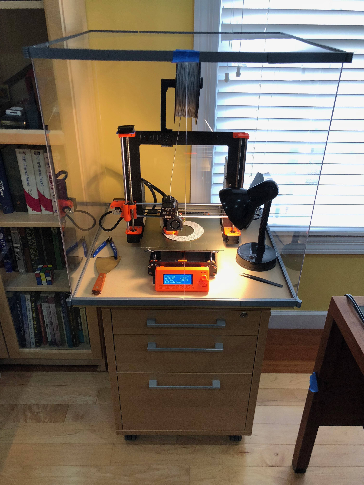

# Simple OpenSCAD Press-fit Acrylic Printer Enclosure
_Pat Niemeyer (pat@pat.net), https://github.com/patniemeyer/enclosure_

<table>
  <tr>
    <th>
      
    </th>
    <th>
      
    </th>
    <th>
    
    </th>
  </tr>
</table>

This is my attempt at a simple, customizable press-fit printer enclosure that works with cheap (2.5mm or 3mm) acrylic and looks nice. The gihub project contains the OpenSCAD files that can be customized for any material thickness and box dimensions. Although I iterated on this a bit when I was building mine, I’d still consider this experimental so please read the notes below on what worked well and what didn’t.  I’m satisfied with the results and if I ever have another need for a giant acrylic box I’ll refine it more!

## Goals and room for improvement

* Use cheap acrylic:  1/4” acrylic is expensive.   You can get 3 sheets of 24x48” 3mm acrylic at Menard’s for less than $100 (you only really needed 2.5 of those for 5 panels). 

* Press-fit:  I did not want to have to drill or glue.  Other than getting 24” x 24” acrylic and cutting one in half for the doors I wanted to be able to press it together and perhaps take it apart when not needed.  In practice, the press-fit worked for some pieces but ended up a bit loose on others.  Ultimately I ended up putting a few spots of hot glue on strategic points to keep it from sliding.

* Base or no base:  The design incorporates a 24” x 24” base, but this can be removed (turned off in the scad file) for the bottom pieces if you prefer it to sit flush on a table.  Home Depot has 3/4” MDF square boards that are exactly 24” on a side for about $5. Sitting on a base allows the outside hinges to open the doors more freely.   If you use the base you may need to secure it since it doesn’t have much horizontal support in the front and could tend to slide off.

* Simple parts: Ideally it would use just three types of parts: straight edges, corner pieces, and hinged corner pieces.  In practice the thin acrylic slumped a bit on the “roof”, which made it harder to close the doors and in an attempt to fix this I adding the corner braces.  Unfotunately this means that there are now left and right hinges for the doors.   (Note: If you don’t care about the enclosure being air tight you don’t need the straight pieces!)

## Printing the parts 

The STL folder contains rendered models for a 24"x24" box with 0.118" / 3.0mm acrylic, but the scad files are easily adapted for any size and thickness.  If there is any interest in the project I will expand the pre-rendered selection and add instructions for options that can be customized. For now you'll just have to look at the source or ask me.

It does take a while to print the parts, but only the hinges require much detail.  I printed the straight and corner pieces at 0.2 or 0.35mm and the hinges at 0.1mm on my Prusa MK3.  The 12” straight pieces will fit if turned diagonally.

## Cutting Acrylic (if you have to) 
If you end up like me buying 48” sheets of acrylic you’ll need to cut them somehow.  I bought a 200 tooth table saw blade for $10 and it worked, but the results were a bit pitted.  Be sure to keep the plastic coating on the acrylic until you are finished cutting (or put blue painters tape on to protect if if you have exposed sheets).

## Ventilation 
I ended up placing mine on a table that it slightly smaller than the 24” base, allowing me to put a fan vent hole in the bottom.  In practice a 40mm fan can suck out enough air that it doesn’t really matter where it is.  I’m planning to vent it to a window later.

## Quiet!
Almost any kind of box that seals reasonbly well will dramatically reduce the sound of your printer- especially the high frequency whine of fans.  So yes, this does work well to reduce noise.

